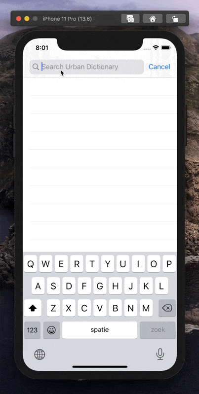

# Urban Dictionary iOS

This is a simple Urban Dictionary iOS app.

## Why

I made this small project because I wanted to play around with:

- Swift Package Manager
  - Verdict: very nice!
- RxSwift
  - Verdict: very nice! Takes some getting used to, but that’s to be expected.
- UI Testing
  - Verdict: very nice! I ended up using [Swifter](https://github.com/httpswift/swifter) to create a mock server, because I don't like the idea of testing against a live server.

Since this is just a small test project, I will probably not accept any pull requests 🤷‍♀️

Also since this is a test app, it might be a little rough around the edges. There are no loading and error states, for example.

---

Urban Dictionary is a registered trademark. Urban Dictionary is not affiliated with this app. It uses an undocumented API so it could break in the future.
